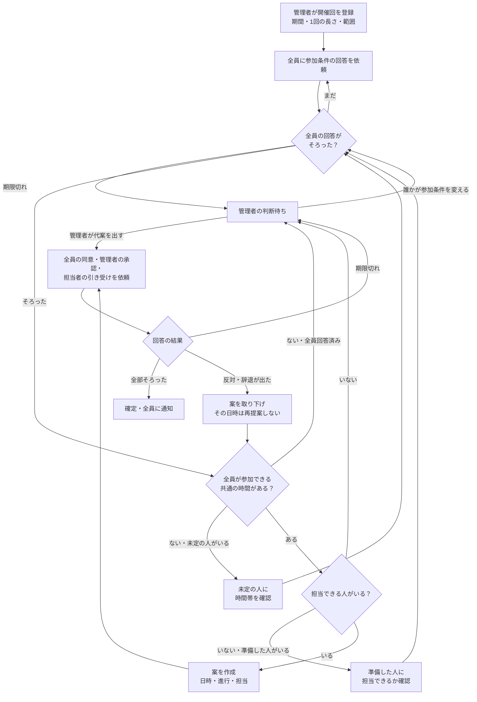
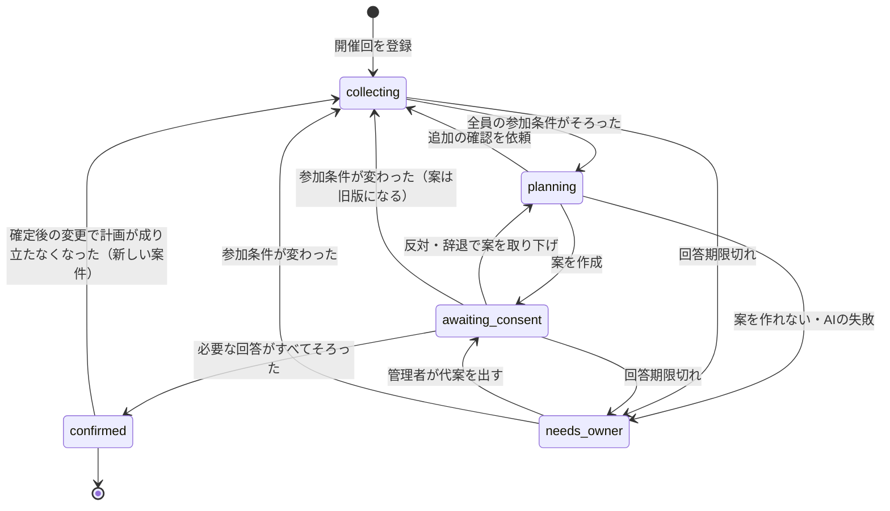
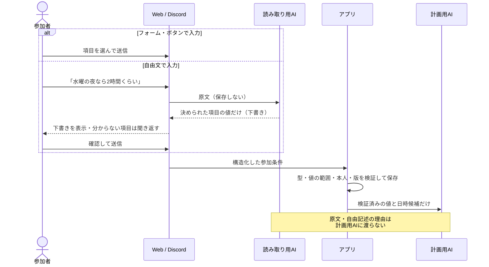
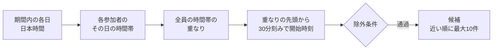
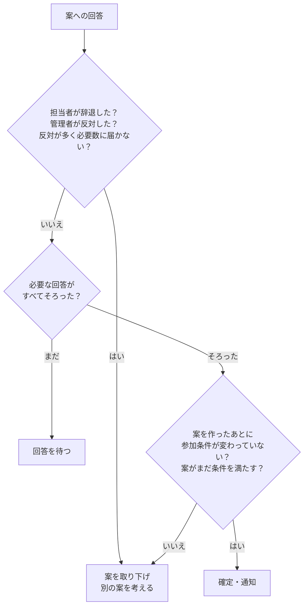

# 輪読の日程調整ルール

輪読会の1回分について、日時・進行・担当を決めるまでの流れとルールをまとめます。
記述は 2026-09-21 時点の実装（`feat/structured-scheduling`）に合わせています。根拠のコードは各節の末尾に示します。

## 1. 基本方針

| 方針 | 内容 |
| --- | --- |
| 全員参加を優先 | 日時が未定の回は、**会の全員**が参加できる日時だけを候補にする。欠席者を除いて多数決で進めることはしない |
| 未回答を賛成に数えない | 参加条件・案への回答がそろわなければ確定しない。期限を過ぎたら管理者の判断に回す |
| AIは提案だけ | 案を作るのはAIまたは規則だが、保存・確定の条件はアプリが検証する。承認・引き受けは本人のボタン操作でだけ記録する |
| 自由文は下書き止まり | Discord・Webの自由文から読み取った値は下書き。本人が確認して送信したときだけ保存する。原文は保存せず、計画を作るAIにも渡さない |
| 決めるのは次の1回だけ | 期間全体の複数回をまとめて決めることはしない |

## 2. 登場人物

| 役割 | できること・求められること |
| --- | --- |
| 管理者（owner） | 会と開催回の登録。案の承認。AIが止まったときの判断（代案を出す） |
| 参加者（member） | 参加条件の回答（参加可否・読んだ範囲・説明できる範囲と分数・参加できる時間帯）。案への同意 |
| 担当者 | 案で説明を割り当てられた参加者。担当を引き受けるか本人が回答する |
| エージェント | 回答を集め、条件を満たす案を作る。足りない情報は本人に確認を依頼する |

管理者も参加者の1人として数えます。

## 3. 全体の流れ

## 4. 状態の遷移

開催回ごとに「案件」を1つ持ち、次の状態を移ります。

「参加条件が変わった」ときは、いったん `collecting` に戻ります。全員の回答がそろっていれば、そのまま `planning` へ進みます。

| 状態 | 画面の表示 | 意味 |
| --- | --- | --- |
| `collecting` | 参加条件を集めています | 参加条件の回答待ち |
| `planning` | 案を作っています | エージェントが次の一手を考えている |
| `awaiting_consent` | 同意を集めています | 案への同意・承認・引き受けの回答待ち |
| `confirmed` | 確定しました | 計画が確定し、通知を送った |
| `needs_owner` | 管理者の判断待ち | 自動では進められない。自動での再試行はしない |

## 5. 参加条件の入力

### 5.1 聞く項目

| 項目 | 値 | 日時未定の回 | 日時が決まっている回 |
| --- | --- | --- | --- |
| 参加できるか | 参加／欠席 | 聞く（「参加を希望」＝日時はこれから調整） | 聞く |
| 読んできた範囲 | 範囲の選択 | 聞く | 聞く |
| 説明を担当できるか | はい／いいえ | 聞く | 聞く |
| 説明できる範囲・分数 | 読んだ範囲の中から選択・1〜会の長さ（分） | 担当できる場合だけ | 担当できる場合だけ |
| 参加できる時間帯 | 下の表 | **聞く** | 聞かない |
| 出られない日 | 日付（任意） | 聞く | 聞かない |

欠席・辞退の理由は聞かず、記録もしません。

### 5.2 参加できる時間帯の形

| 状態 | 意味 | 時間帯 | 最大参加時間 |
| --- | --- | --- | --- |
| `provided` | 時間帯を答えた | 1件以上 | 1〜480分 |
| `unknown` | まだ分からない | なし | 0 |
| `unavailable` | 期間中は参加できない | なし | 0 |

- 時間帯は「毎週◯曜 HH:mm〜HH:mm」と「YYYY-MM-DD HH:mm〜HH:mm」の2種類。どちらも日本時間で、同じ日のうちに収める（終了の 24:00 は画面では 0:00 と表示）
- 各60件まで
- 同じ日の重なる・隣り合う時間帯は1つにまとめて扱う

### 5.3 入力の経路

| 経路 | 使い方 |
| --- | --- |
| Web | 開催回の画面の「参加条件を答える」。自由文から下書きを作ることもできる |
| Discord DM | 「参加条件」と送ると1項目ずつ質問が来る。すべてそろうと確認ボタンが出る。押したときだけ保存される |
| Discord DM（案への回答） | 「回答」と送ると現在の案と回答ボタンが出る。ボタンは本人・メッセージ・案の版に結び付いていて、古い版への回答は受け付けない |

根拠：`src/backend/internal/playbook/reading/availability.go`、`src/backend/internal/coord/interpret.go`、`src/backend/internal/discord/`

## 6. 日時候補の決め方

日時が未定の回だけに適用します。

### 6.1 手順

1. 会の**全員**について、その日に参加できる時間帯を求める
   - 参加条件が未回答、または「欠席」の人が1人でもいれば、候補は0件
   - 予定が `unknown`／`unavailable` の人がいれば、候補は0件
   - 最大参加時間が会の長さより短い人がいれば、候補は0件
   - その日が「出られない日」に入っていれば、その人は参加できない（他の指定より優先）
   - その日付の時間帯を指定していればそれを使い、なければその曜日の時間帯を使う
2. 全員の時間帯の重なりのうち、会の長さ以上続くものを残す
3. 重なりの開始から30分刻みで、開始＋会の長さが重なりに収まる時刻を並べる
4. 次のものを除く
   - 今から1時間以内に始まる時刻
   - 同じ案件で一度反対・辞退されて取り下げになった案の日時
5. 近い順に最大10件を計画用AIに渡す。AIを使わない設定（`AGENT_MODE=fake`）では最も早い候補を使う

### 6.2 例（会の長さ60分）

| 参加者 | 水曜 | 土曜 |
| --- | --- | --- |
| A | 20:00〜23:00 | 13:00〜18:00 |
| B | 19:00〜22:00 | 15:00〜17:00 |
| C | 21:00〜24:00 | 指定なし |
| **全員の重なり** | **21:00〜22:00** | **なし（Cが指定なし）** |
| **開始候補** | **21:00** | — |

C の最大参加時間が45分なら、会の長さ60分に届かないため候補は0件になります。

根拠：`availableWindows`・`commonWindows`（`playbook/reading/availability.go`）、`candidateDays`（`playbook/reading/schedule.go`）

## 7. 案の中身の決め方

### 7.1 担当の割り当て

| 順 | ルール |
| --- | --- |
| 1 | 担当候補は「参加」「説明を担当できる」と答え、今回の案件で担当を辞退していない人 |
| 2 | 対象の範囲ごとに、その範囲を説明できて残り時間が5分以上ある人から選ぶ |
| 3 | 同じ条件の人が複数いれば、**今の担当者を維持 → 続けて代役になった回数が少ない人 → 残り時間が長い人 → 登録順** |
| 4 | 担当できる人がいない範囲は次回に持ち越す |
| 5 | 再計画で、同じ人を3回続けて代役にはしない |

担当が1つも決まらない場合、その範囲を読んできた人に「担当できるか」を確認します（同じ人に2回は聞きません）。確認できる人がいなければ管理者の判断待ちになります。

### 7.2 時間の配分（AIを使わない設定の場合）

| 項目 | 分数 |
| --- | --- |
| 前回範囲の復習 | 読了済みの範囲があるときだけ。会の長さの1/3（上限20分） |
| 説明 | 残りの2/3を担当範囲で分ける。担当者が答えた分数を超えない |
| 議論 | 残り（5分以上あるとき） |

AIが作る場合も、次の検証を通らない案は保存しません。

| 検証 | 内容 |
| --- | --- |
| 日時 | 期間内・1時間より先・6章の条件を満たす・出られない日でない・取り下げた日時でない |
| 範囲 | 今回扱う範囲と持ち越す範囲を合わせると、登録した対象範囲と一致する |
| 担当 | 参加予定で、担当できると答え、その範囲を説明できる人。答えた分数を超えない |
| 時間 | 合計が会の長さ以内。各項目1分以上、項目は上限件数まで |

根拠：`DraftPlan`（`playbook/reading/draft.go`）、`ValidatePlan`（`playbook/reading/rules.go`）

## 8. 確定に必要な回答

| 案の種類 | 担当者の引き受け | 管理者の承認 | 参加者の同意 |
| --- | --- | --- | --- |
| 初回・日時未定の回 | 担当者全員 | 必要 | **全員**（会の全員が参加予定であることが前提） |
| 初回・日時が決まっている回 | 担当者全員 | 必要 | 不要 |
| 再計画・担当者だけが変わった | 新しい担当者全員 | 不要 | 不要 |
| 再計画・範囲や時間配分も変わった | 担当者全員 | 不要 | 参加予定者の過半数（期間から調整した回は**全員**） |

- 必要な人数と対象者は、案を作った時点で固定します。あとから対象者を減らして成立させることはしません
- 確定した時点で、残っている未回答の依頼は無効になります
- 代理での回答はできません。依頼は本人宛てだけで、他人の依頼には回答できません

根拠：`ApprovalRequirements`（`playbook/reading/rules.go`）、`normalizeRequirements`・`evaluate`・`confirm`（`coord/flow.go`）

## 9. 期限と催促

| 項目 | ルール |
| --- | --- |
| 回答期限 | 依頼から24時間後か、開催の1時間前の早い方 |
| 期限を確保できない場合 | 回答時間が30分未満しか取れないときは依頼を出さず、管理者の判断待ちにする |
| 日時未定の回の基準日 | 参加条件の依頼は**期間の最終日の終わり**を開催日とみなして期限を計算する。案への回答は、案で示した日時を基準にする |
| 催促 | 期限の中間で、未回答の人に1回だけ送る |
| 期限切れ（参加条件） | 本人の参加条件が1度も保存されていなければ管理者の判断待ち。エージェントからの追加確認に答えなかっただけなら、保存済みの内容で先へ進む |
| 期限切れ（案への回答） | 管理者の判断待ち。未回答を賛成にも欠席にも数えない |
| 開催回の登録 | 開催の1時間より前でないと登録できない |

根拠：`dueAt`・`responseHorizon`（`coord/coordinator.go`）、`handleDeadline`・`handleReminder`（`coord/runner.go`）

## 10. 管理者の判断に回る場合

| 理由コード | 画面の表示 | 主な原因 |
| --- | --- | --- |
| `no_feasible_plan` | 条件を満たす案を作れませんでした | 全員の共通時間がない／担当できる人がいない／参加予定者がいない／確定済みの日時に全員が参加できなくなった |
| `deadline_expired` | 回答の期限までに条件が揃いませんでした | 回答期限切れ／開催まで時間がなく期限を確保できない |
| `model_error` | AIの処理が失敗しました | AIの出力が形式や条件を満たさなかった |
| `budget_exceeded` | AIの呼び出し回数の上限に達しました | 1回の処理で8回、1案件で24回の上限を超えた |

AIへの接続が一時的に失敗したときは、30秒から10分まで間隔を広げながら再試行します。回答期限を確保できなくなる時刻を過ぎたら、再試行をやめて管理者の判断待ちにします。

管理者の判断待ちから抜ける方法は次の2つです。

1. 管理者が代案を出す。代案にも8章と同じ回答が必要
2. 誰かが参加条件を変える（時間帯を広げる、担当を引き受けるなど）。案件が回答の収集に戻り、もう一度案を作る

## 11. 確定後の変更

| 変更 | 結果 |
| --- | --- |
| 参加条件を変えても、確定した計画がまだ条件を満たす | 何もしない |
| 担当者が辞退した・計画が条件を満たさなくなった | 新しい案件を開いて再計画する（8章の「再計画」の回答が必要） |
| 期間から調整した回で、確定日時に全員が参加できなくなった | 欠席者を除いて続けることはしない。管理者の判断待ちになる |
| 確定した日時を変えたい | 日時を変える機能はない。新しい開催回として登録し直す |

## 12. 対象外

- 期間全体の複数回をまとめて決めること（決めるのは次の1回だけ）
- カレンダー連携・会場の予約
- 全員参加の例外を認める仕組み（誰かが欠席でも進める判断）
- 運営方針をあらかじめ承認しておき、個別の承認を省くこと
